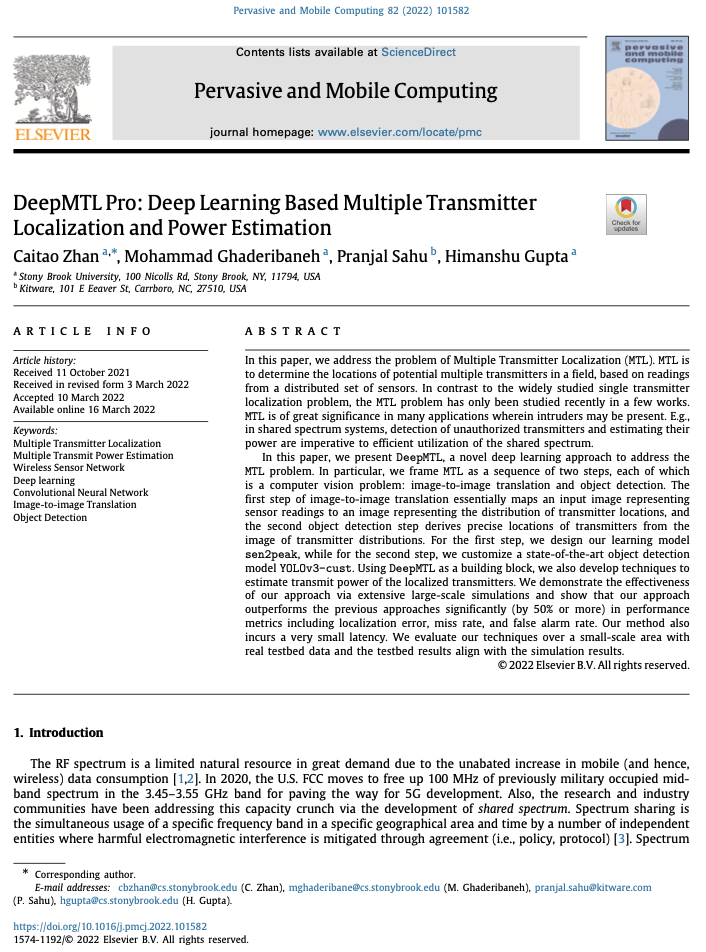

# DeepMTL: Deep Learning Based Multiple Transmitter Localization. 
The YOLOv3 part of the paper is in this repo: https://github.com/caitaozhan/PyTorch-YOLOv3

This is the repository of my IEEE WoWMoM 2021 paper: [IEEE Link](https://ieeexplore.ieee.org/document/9469431), [Open Access PDF link](https://caitaozhan.github.io/file/DeepMTL.pdf).

The WoWMoM conference presentation is on my [YouTube channel](https://www.youtube.com/watch?v=arnhAloIr90).

The WoWMoM conference paper is extended to the Elsevier journal Pervasive and Mobile Computing (PMC): [Elsevier Link](https://doi.org/10.1016/j.pmcj.2022.101582), [Open Access PDF link](https://arxiv.org/abs/2112.13181). The Elsevier version is also uploaded in this repository, checkout [deepmtl-pro-final.pdf](https://github.com/caitaozhan/caitaozhan.github.io/blob/master/file/deepmtl-pro-final.pdf). The main new part is the transmit power estimation. Also the quality of writing is improved.

I also made a presentation for the PMC journal paper, plese check my [YouTube channel](https://www.youtube.com/watch?v=DScawc1znjs).

Please cite the DeepMTL conference paper:
```
@INPROCEEDINGS{wowmom21-deepmtl,
title={DeepMTL: Deep Learning Based Multiple Transmitter Localization}, 
booktitle={IEEE 22nd International Symposium on a World of Wireless, Mobile and Multimedia Networks (WoWMoM)}, 
author={Zhan, Caitao and Ghaderibaneh, Mohammad and Sahu, Pranjal and Gupta, Himanshu},
year={2021},
doi={10.1109/WoWMoM51794.2021.00017}
}
```

Please cite the DeepMTL Pro journal paper:
```
@article{pmc22-deepmtlpro,
title = {DeepMTL Pro: Deep Learning Based Multiple Transmitter Localization and Power Estimation},
author = {Caitao Zhan and Mohammad Ghaderibaneh and Pranjal Sahu and Himanshu Gupta},
journal = {Pervasive and Mobile Computing},
year = {2022},
doi={10.1016/j.pmcj.2022.101582}
}
```


